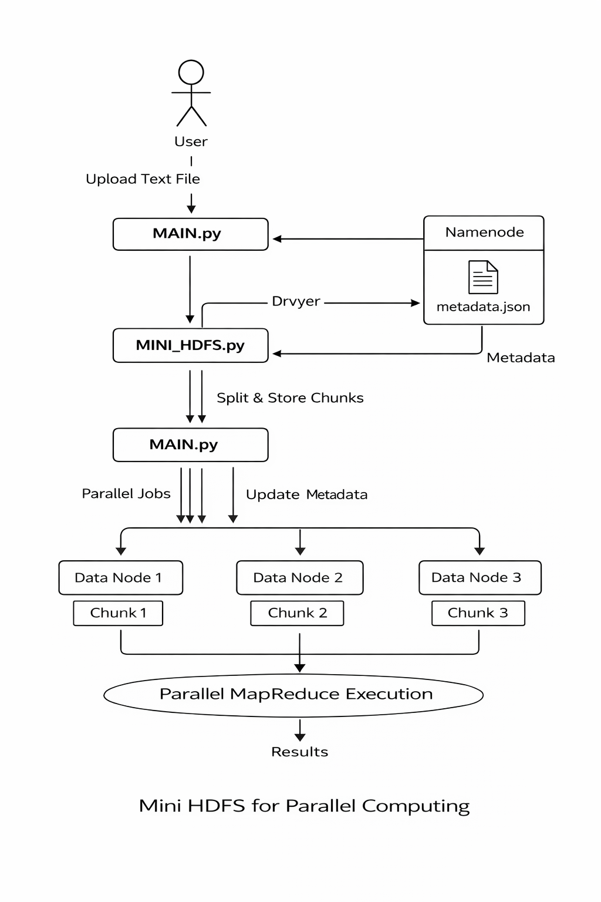

# Mini HDFS for Parallel Computing

A **Mini Distributed Analytics System** that simulates a simplified Hadoop-like architecture using a custom **Mini HDFS** storage layer and **parallel MapReduce-style computation** in Python.

This project demonstrates core concepts of **distributed storage, metadata management, and parallel processing**, built entirely from scratch for academic and learning purposes.

---

##  Key Features

- Custom **Mini HDFS** with:
  - Namenode for metadata management
  - Multiple data nodes for chunk storage
- **Line-safe file splitting** (no broken words or partial lines)
- Parallel data processing using **Python multiprocessing**
- MapReduce-style execution:
  - Map phase on distributed chunks
  - Reduce phase for global aggregation
- Interactive **CLI interface** with colored output
- Supports multiple analytics jobs:
  - Total Word Count
  - Global Most Frequent Word

---

## System Architecture

---

## ⚙️ How It Works

### 1.File Upload & Storage
- User uploads a text file
- File is **split line-by-line** into fixed chunks
- Each chunk is stored in a separate data node
- Namenode records metadata (file → chunks → nodes)

### 2.Parallel Processing
- Each chunk is processed **independently** using multiprocessing
- Map functions operate on chunk content
- Reduce phase aggregates results into a global output

### 3.Supported Jobs
| Job | Description |
|----|------------|
| Word Count | Computes total number of words across all chunks |
| Most Frequent Word | Finds globally most common word |

---

